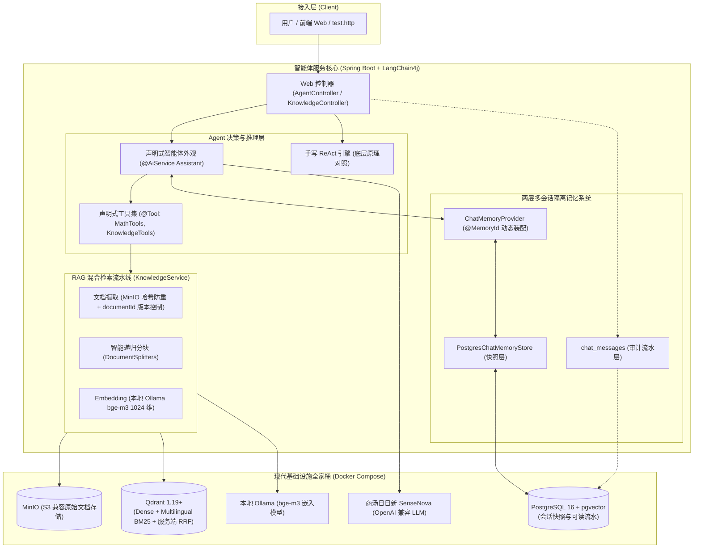

# MyAgent：基于 Spring Boot + LangChain4j 的企业级自主智能体系统

[](https://openjdk.org/)
[](https://spring.io/projects/spring-boot)
[](https://github.com/langchain4j/langchain4j)
[](https://qdrant.tech/)
[](https://www.postgresql.org/)

> **核心设计哲学**：拒绝黑盒魔法，知其然更知其所以然。  
> 从零手写经典 **ReAct 推理引擎（手动挡）** 启动，深度理解底层 Prompt 构造、正则提取与工具调用循环；进而过渡至 **LangChain4j 声明式框架（自动挡）**，并逐步整合 Docker 现代基础设施、Qdrant 单引擎混合检索 RAG、以及生产级两层会话持久化与物理隔离记忆系统。

---

## 🏗️ 系统总体架构与技术栈



### 技术栈清单

| 类别 | 技术选型 | 版本 / 说明 | 核心职责 |
| :--- | :--- | :--- | :--- |
| **基础语言** | Java | 21 (LTS) | 现代 Java 特性、Virtual Threads 与模式匹配支持 |
| **基础框架** | Spring Boot | 3.3+ | 依赖注入、Web MVC、JdbcTemplate、自动装配 |
| **构建工具** | Gradle | Kotlin DSL (`build.gradle.kts`) | 依赖管理与跨平台构建 |
| **AI 框架** | LangChain4j | 1.x 现代化接口规范 | `@AiService`、`@Tool`、`ChatModel`、动态代理 |
| **主力模型** | 商汤日日新 (SenseNova) | OpenAI 兼容协议 | 高性能云端 LLM 推理与 Function Calling |
| **嵌入模型** | BGE-M3 (Ollama) | 1024 维密集向量 | 本地私有化 Embedding，零成本、低延迟 |
| **向量数据库** | Qdrant | 1.19+ | Dense 向量 + 服务端原生多语言 BM25 + 服务端 RRF 融合 |
| **关系数据库** | PostgreSQL | 16 (带 pgvector 扩展) | 会话状态快照（`chat_memory_store`）与可读流水（`chat_messages`） |
| **对象存储** | MinIO | S3 兼容最新版 | 知识库原始文档持久化与元数据防重 |
| **基础设施** | Docker Compose | 统一编排 | 一键拉起 Postgres、Qdrant、MinIO、ES、Elasticvue |

---

## 🗺️ 学习演进路线与深度指南

本项目按照递进式的学习与工程落地节奏设计，各阶段均配有详尽的技术剖析与实操指南：

| 阶段 | 核心主题 | 状态 | 核心成果与关键设计 | 详尽文档导航 |
| :---: | :--- | :---: | :--- | :--- |
| **Phase 1** | **手写 ReAct 核心引擎** | 已完成 ✅ | Prompt 模板驱动、`while` 思考循环、正则解析工具调用 | [`ROADMAP.md`](ROADMAP.md#阶段一极简-react-智能体状态已完成-) |
| **Phase 2** | **现代基础设施 Docker 化** | 已完成 ✅ | Docker Compose 编排 PG、Qdrant、MinIO、ES，一键环境探活 | [`ROADMAP.md`](ROADMAP.md#阶段二现代基础设施容器化状态已完成-) |
| **Phase 3** | **LangChain4j 声明式工程化** | 已完成 ✅ | `@AiService` 动态代理、`@Tool` 强类型注解、Function Calling 机制 | [`docs/PHASE3_GUIDE.md`](docs/PHASE3_GUIDE.md) |
| **Phase 4** | **工业级 RAG 与单引擎混合检索** | 已完成 ✅ | MinIO 两层哈希防重、`documentId` 版本控制、Qdrant 原生多语言 BM25 + Dense + RRF | [`docs/PHASE4_GUIDE.md`](docs/PHASE4_GUIDE.md)<br>[`docs/DOCUMENT_ID_DESIGN.md`](docs/DOCUMENT_ID_DESIGN.md) |
| **Phase 5.1** | **生产级多会话隔离与持久化** | 已完成 ✅ | 两层记忆模型（机器快照 + 人类流水）、PostgreSQL 原生 Upsert、自愈消息头清洗 | [`docs/PHASE5_GUIDE.md`](docs/PHASE5_GUIDE.md) |
| **Phase 5.2** | **打字机流式响应 (SSE)** | 待开始 ⏳ | `StreamingChatModel` + `SseEmitter` 逐字流式打字与中间工具调用状态推送 | 规划中 |
| **Phase 5.3** | **工具异常反思与自愈** | 架构方案已就绪 📐 | 双环容错架构、ToolExecutionErrorHandler、防死循环熔断与自愈心智 | [`docs/TOOL_ERROR_HANDLING_AND_REFLECTION.md`](docs/TOOL_ERROR_HANDLING_AND_REFLECTION.md) |

---

## 🚀 快速上手与运行指南

### 1. 准备工作
- 安装 **JDK 21**
- 安装 **Docker** 与 **Docker Compose**
- 本地启动 **Ollama** 并拉取嵌入模型：
  ```bash
  ollama run bge-m3
  ```

### 2. 配置环境变量
在项目根目录复制环境变量模板：
```bash
cp .env.example .env
```
编辑 `.env` 文件，填入商汤开放平台的 API Key（或任何 OpenAI 兼容的模型凭证）：
```properties
LLM_API_KEY=your_sensenova_api_key_here
LLM_BASE_URL=https://token.sensenova.cn/v1
LLM_MODEL_NAME=SenseChat-5
```

### 3. 一键拉起基础设施
```bash
# 启动 PostgreSQL, Qdrant, MinIO, Elasticsearch, Elasticvue
docker compose up -d

# 验证容器健康状态
powershell ./scripts/check-infra.ps1
```

各服务默认控制台端口：
* **Qdrant Web Dashboard**：`http://localhost:6333/dashboard`
* **MinIO 控制台**：`http://localhost:9101`（账号: `minioadmin` / 密码: `minioadmin_password`）
* **Elasticvue (ES 控制台)**：`http://localhost:8088`

### 4. 运行工程与自动化测试
```bash
# 运行全套单元与集成测试（包含 7 大测试套件，自动验证多会话隔离与快照恢复）
./gradlew test

# 启动 Spring Boot Web 服务
./gradlew bootRun
```

---

## 🧪 接口体验与测试指南

建议在 IntelliJ IDEA 或 VS Code 中直接打开 [`test.http`](test.http) 文件，点击请求即可发起端到端测试：

1. **多会话隔离与记忆保持测试**：
   * `GET /api/agent/declarative?conversationId=user-alice&query=你好，我是爱丽丝，负责智能客服。`
   * `GET /api/agent/declarative?conversationId=user-bob&query=hey,我是鲍勃，我正在学习Agent。`
   * 分别跨轮向 Alice 和 Bob 发问，验证两者的记忆互不干扰、绝不串戏。
2. **人类可读对话流水拉取**：
   * `GET /api/agent/conversations/user-bob`（查看鲍勃的干净气泡聊天记录）。
3. **会话彻底重置与物理清空**：
   * `DELETE /api/agent/conversations/user-bob`（同时驱逐内存、清空数据库快照并抹除审计日志）。
4. **工业级文档上传与混合检索 RAG**：
   * `POST /knowledge/documents`（上传 Markdown/PDF 文档，支持自动去重）。
   * `GET /knowledge/hybrid-search?query=...`（Dense + BM25 + RRF 单引擎混合检索）。
   * `GET /api/agent/declarative?query=请查阅团队技术规范文档，计算21楼离地面高度...`（自主检索知识库 + 调用数学工具完成链式推理）。

---

## 🛡️ 安全与代码规范
- **敏感数据零泄露**：全项目严禁硬编码任何 API Key、密码或 Token，所有密钥统一经由 `.env` 或环境变量注入，且 `.env` 严格由 `.gitignore` 保护。
- **透明无黑盒**：优先使用 Spring 官方原生组件（如 `JdbcTemplate`）实现底层 K-V 快照存储，杜绝引入笨重 ORM 带来的隐式拦截器和黑盒魔法。
- **新手友好注释**：所有核心接口、配置类与测试用例均配有详细的中文原理解析注释。
