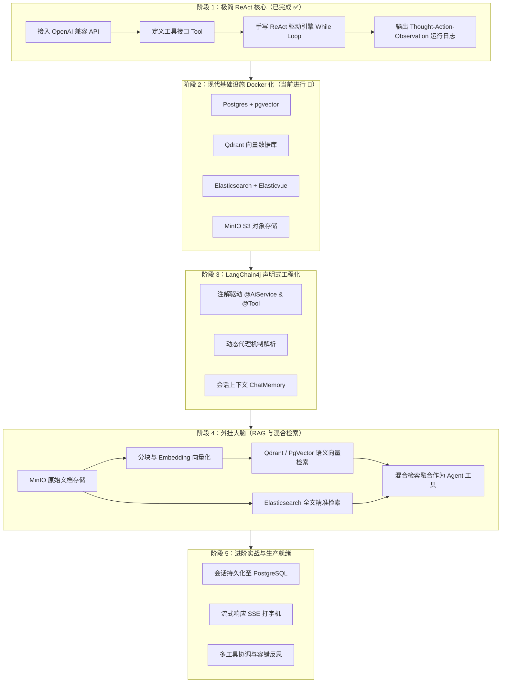

# MyAgent 开发演进与学习路线图 (Roadmap)

> 本文档用于规划从零开发基于 **Spring Boot + LangChain4j** 的 Agent 智能体系统。  
> 路线设计原则：**从最底层的核心原理（手写 ReAct 思考与行动循环）起步，不依赖黑盒，彻底理解 Agent 本质后，再逐步集成现代企业级基础设施（Docker、向量库、对象存储、全文检索引擎）与高级工程化特性。**

---

## 🏗️ 总体架构与阶段全景

---

## 阶段一：极简 ReAct 智能体（状态：已完成 ✅）

### 1.1 落地成果与复盘
* **秘钥与环境隔离**：引入 `dotenv-java`，根目录 `.env` 安全生效并被 `.gitignore` 严格保护；提供 `.env.example` 示例模板。
* **模型标准对齐**：使用 LangChain4j 1.x 规范中的现代化核心接口 `ChatModel`；排查解决商汤开放平台 OpenAI 兼容域名路由问题，对齐为 `https://token.sensenova.cn/v1`。
* **工具体系**：
  * `AgentTool`：统一接口抽象。
  * `CalculatorTool`：算术计算工具。
  * `WeatherTool`：模拟天气查询工具。
* **手写 ReAct 引擎**：
  * `ReActEngine`：基于经典 Prompt 模板构造思考规范，利用 Java 正则与 `while` 循环完成了 `Thought -> Action -> Action Input -> Observation -> Final Answer` 的完整推理闭环。
* **测试与验证**：
  * `ReActAgentLiveTest`：成功执行“查询北京气温并做算术计算”的复合任务，多轮思考与工具执行全部调通。
  * 优化 JVM 参数（`-XX:+EnableDynamicAgentLoading` 和 `-Xshare:off`），消除 JDK 21 下的干扰警告。

---

## 阶段二：现代基础设施容器化（状态：已完成 ✅）

### 2.1 核心目标
* 采用 `docker-compose.yml` 统一编排与拉起现代 AI 智能体开发必备的基础设施全家桶。
* 共享已有的 `.env` 文件，实现数据库账号、MinIO 秘钥的无缝注入。

### 2.2 服务清单与端口规划

| 服务名称 | 镜像与版本 | 宿主机端口 | 用途与说明 |
| :--- | :--- | :--- | :--- |
| **PostgreSQL + pgvector** | `pgvector/pgvector:pg18` | `5432:5432` | 业务元数据存储 + 关系型向量索引，用于长期会话历史与关系数据 |
| **Qdrant** | `qdrant/qdrant:latest` | `6333:6333`, `6334:6334` | 专为海量高并发设计的向量数据库，自带 Web Dashboard（`http://localhost:6333/dashboard`） |
| **Elasticsearch** | `docker.elastic.co/elasticsearch/elasticsearch:8.15.0` | `9200:9200` | 关键词/全文倒排索引，用于混合检索（与向量检索互补） |
| **Elasticvue** | `cars10/elasticvue:latest` | `8088:8080` | Elasticsearch 轻量级可视化 Web 管理控制台 |
| **MinIO** | `minio/minio:latest` | `9100:9000`, `9101:9001` | S3 兼容的高性能对象存储；Web 控制台在 `9101`（避开本地已有项目的 9000/9001） |

### 2.3 落地成果
1. **编写 `docker-compose.yml`**：定义 PostgreSQL(pgvector)、Qdrant、Elasticsearch、Elasticvue、MinIO 容器配置与数据卷持久化目录。（已完成 ✅）
2. **编写 PostgreSQL 初始化脚本**：`docker/postgres/init.sql`，预先开启 `vector` 扩展并建立基础库。（已完成 ✅）
3. **编写服务验证与启动脚本**：`scripts/check-infra.ps1`，一键命令启动与健康检查，5 大中间件全绿运行。（已完成 ✅）

---

## 阶段三：LangChain4j 声明式工程化演进（状态：当前进行 🚀）

### 3.1 核心目标
* 对比阶段一中手写的 `while` 循环与单出入参限制，体验 LangChain4j 的声明式封装。
* 理解框架背后的工作原理：**框架不是魔法，只是用 JDK 动态代理 + OpenAI Function Calling 规范帮我们自动完成了阶段一我们手写的事**。

### 3.2 演进内容：从手写接口到声明式 @Tool
1. **工具定义的范式跃迁 (Tool Evolution)**：
   * **阶段一痛点**：入参只能是单个 `String`（需要自己解析字符串），大模型容易传错格式。
   * **阶段三升级**：
     * 普通 Java 方法直接标注 `@Tool("方法用途描述")`。
     * 参数使用 `@P("参数说明与格式约束")` 进行精确类型定义（支持 `int`、`double`、`String`、乃至复杂 JavaBean）。
     * LangChain4j 自动通过反射提取方法签名，生成符合 OpenAI 标准的 JSON Schema 传递给模型。
2. **声明式智能体外观 (@AiService)**：
   * 仅需定义一个 Java 接口（如 `Assistant` 或 `DeclarativeAgent`），声明对话方法签名。
   * 支持 `@SystemMessage` 静态/动态模板注入人设与规则约束。
3. **智能体会话记忆 (ChatMemory)**：
   * 接入 `MessageWindowChatMemory`（滑动窗口记忆），实现跨轮次多轮连续对话上下文保持。
4. **架构装配与验证**：
   * 采用 `AiServices.builder()` 工厂组装 `ChatModel`、`Tools` 与 `ChatMemory`。
   * 编写 Controller 对外暴露端点，并编写多轮对话测试用例验证效果。

### 3.3 阶段三动手任务清单
- [ ] **任务 3.1**：编写声明式工具类（如 `CalculatorService` 或改造现有工具），掌握 `@Tool` 与 `@P` 注解用法。
- [ ] **任务 3.2**：定义智能体接口 `Assistant`，编写 `@SystemMessage` 系统提示词。
- [ ] **任务 3.3**：在 Spring 配置类中通过 `AiServices.builder(...)` 装配 Bean，注入 `ChatMemory`。
- [ ] **任务 3.4**：编写 Web 控制器与多轮对话测试，观察大模型 Function Calling 底层日志与上下文保持能力。

---

## 阶段四：知识库外挂与混合检索增强（RAG）（待开始 ⏳）

### 4.1 核心目标
* 让 Agent 拥有外部“海马体”与私域知识，解决大模型幻觉与信息滞后问题。

### 4.2 模块实现
1. **文件上传与入库流水线**：
   * 用户上传 PDF / Markdown / TXT 文档至 **MinIO**。
   * 使用 LangChain4j `DocumentSplitter` 切分文本块（Chunks）。
   * 调用 `EmbeddingModel` 转化为多维向量。
   * 向量写入 **Qdrant**（或 **PgVector**）。
   * 文本写入 **Elasticsearch** 建立分词倒排索引。
2. **混合检索工具（Hybrid Search Tool）**：
   * 同时发起向量语义检索与 Elasticsearch 全文检索。
   * 融合结果并排重，封装为 `@Tool` 暴露给 Agent 使用。

---

## 阶段五：进阶实战与生产能力（待开始 ⏳）

### 5.1 核心能力
1. **会话历史持久化**：
   * 将 `ChatMemory` 中的对话消息序列化并存入 PostgreSQL，支持服务重启后恢复会话上下文。
2. **流式打字机响应（SSE）**：
   * 使用 `StreamingChatModel` + Spring WebFlux / `SseEmitter`，实现类似 ChatGPT 的逐字输出效果。
3. **异常反思与自愈（Self-Correction）**：
   * 当 Agent 调用的工具返回错误异常时，引导模型反思参数或换用其他工具尝试。
