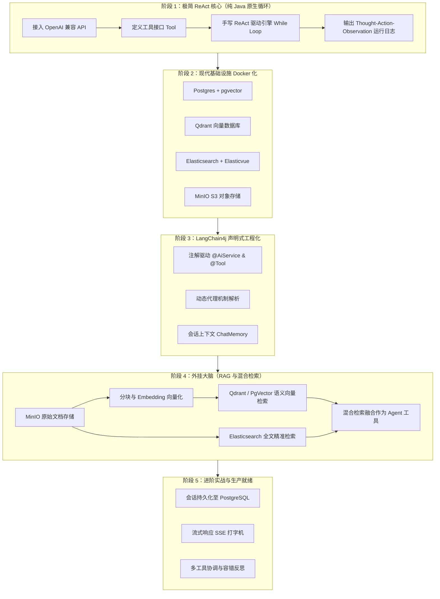

# MyAgent 开发演进与学习路线图 (Roadmap)

> 本文档用于规划从零开发基于 **Spring Boot + LangChain4j** 的 Agent 智能体系统。  
> 路线设计原则：**从最底层的核心原理（手写 ReAct 思考与行动循环）起步，不依赖黑盒，彻底理解 Agent 本质后，再逐步集成现代企业级基础设施（Docker、向量库、对象存储、全文检索引擎）与高级工程化特性。**

---

## 🏗️ 总体架构与阶段全景



---

## 阶段一：极简 ReAct 智能体（零中间件，解构底层原理）

### 1.1 核心目标
* 不使用任何外部数据库和重型组件，纯靠 Java 内存运行。
* 不使用框架提供的全自动黑盒（如 `@AiService`），而是**亲手写出 ReAct（Reasoning + Acting）主循环**。
* 亲眼看清大模型每一次的 `Thought`（思考）、`Action`（决策调用哪个工具）、`Action Input`（工具参数）、`Observation`（执行代码并给大模型反馈结果）、直到最终 `Final Answer`。

### 1.2 核心步骤
1. **依赖配置**：
   * 在 `build.gradle.kts` 中引入 `langchain4j-open-ai` 基础包。
2. **OpenAI 兼容客户端配置**：
   * 在 `application.yaml` 声明通用模型配置（`base-url`, `api-key`, `model-name` 等），支持随时替换为你提供的自定义 API。
3. **工具（Tools）定义**：
   * 编写原生 Java 工具类，如：
     * `CalculatorTool`：算术计算工具。
     * `MockWeatherTool`：模拟天气或数据库查询工具。
4. **手写 ReAct 执行引擎**：
   * **Prompt 模板设计**：构造经典的 ReAct 引导词，约束模型必须按指定格式输出思考过程。
   * **正则解析器**：用 Java 正则表达式抓取模型回复中的 `Action: [工具名]` 和 `Action Input: [参数]`。
   * **调度循环（While Loop）**：
     ```text
     用户提问 
       ↓
     [循环开始]
       LLM 推理 -> 得到 Thought 和 Action
       IF 包含 Final Answer -> 输出最终结果，退出循环
       IF 命中 Action -> 执行对应 Java 方法 -> 得到 Observation
       将 Observation 追加到上下文，继续下一轮循环
     [循环结束]
     ```

### 1.3 验证标准
* 运行单元测试或控制台，输入复杂复合问题（例如：*“请查询北京现在的天气气温，然后把气温数值乘以 2.5 加上 10 等于多少？”*）。
* 控制台清晰打印出每一步的思考、工具调用与观察反馈。

---

## 阶段二：现代基础设施容器化（Docker 一键点火）

### 2.1 核心目标
* 采用 `docker-compose.yml` 统一拉起所有现代化数据基础设施，无需手动在宿主机繁琐安装。

### 2.2 服务清单与端口规划

| 服务名称 | 镜像与版本 | 映射端口 | 用途与说明 |
| :--- | :--- | :--- | :--- |
| **PostgreSQL + pgvector** | `pgvector/pgvector:pg16` | `5432:5432` | 业务元数据存储 + 关系型向量索引 |
| **Qdrant** | `qdrant/qdrant:latest` | `6333:6333`, `6334:6334` | 专为海量高并发设计的专用向量数据库，自带 Web Dashboard（访问 `http://localhost:6333/dashboard`） |
| **Elasticsearch** | `elasticsearch:8.x` | `9200:9200` | 关键词/全文倒排索引，用于混合检索关键字兜底 |
| **Elasticvue** | `cars10/elasticvue:latest` | `8080:8080` | Elasticsearch 轻量级可视化 Web 管理界面（访问 `http://localhost:8080`） |
| **MinIO** | `minio/minio:latest` | `9000:9000`, `9001:9001` | S3 兼容对象存储，存知识库原文件、图片等；Web 控制台在 `9001` |

### 2.3 产出物
* 根目录 `docker-compose.yml`
* 数据库初始化 SQL（创建 vector 扩展、初始化库表）

---

## 阶段三：LangChain4j 声明式工程化演进

### 3.1 核心目标
* 对比阶段一中手写的 `while` 循环，体验 LangChain4j 的声明式封装。
* 理解框架背后的工作原理：**框架不是魔法，只是用动态代理帮我们自动做了阶段一我们手写的事**。

### 3.2 演进内容
1. **注解驱动**：
   * 将自定义工具方法加上 `@Tool` 注解。
   * 使用 `@AiService` 接口声明智能体外观。
2. **会话记忆接入**：
   * 引入 `ChatMemory`（如基于滑动窗口的 `MessageWindowChatMemory`）。
   * 实现跨轮次多轮对话的状态保持。
3. **架构分层**：
   * Controller（对外 HTTP 接口） -> Service（Agent 协调层） -> Tools（领域能力层）。

---

## 阶段四：知识库外挂与混合检索增强（RAG）

### 4.1 核心目标
* 让 Agent 拥有外部“海马体”与私域知识，解决大模型幻觉与信息滞后问题。

### 4.2 模块实现
1. **文件上传与入库流水线**：
   * 用户上传 PDF / Markdown / TXT 文档至 **MinIO**。
   * 使用 LangChain4j `DocumentSplitter` 切分文本块（Chunks）。
   * 调用 `EmbeddingModel` 转化为多维向量。
   * 向量写入 **Qdrant**（或 **PgVector**）。
   * 文本写入 **Elasticsearch** 建立分词倒排索引。
2. **混合检索工具（Hybrid Search Tool）**：
   * 同时发起向量语义检索与 Elasticsearch 全文检索。
   * 融合结果并排重，封装为 `@Tool` 暴露给 Agent 使用。

---

## 阶段五：进阶实战与生产能力

### 5.1 核心能力
1. **会话历史持久化**：
   * 将 `ChatMemory` 中的对话消息序列化并存入 PostgreSQL，支持服务重启后恢复会话上下文。
2. **流式打字机响应（SSE）**：
   * 使用 `StreamingChatModel` + Spring WebFlux / `SseEmitter`，实现类似 ChatGPT 的逐字输出效果。
3. **异常反思与自愈（Self-Correction）**：
   * 当 Agent 调用的工具返回错误异常时，引导模型反思参数或换用其他工具尝试。

---

## 🚀 下一步执行指引

当你准备好你的 API 接口文档后，我们将开启 **阶段一**：
1. 请提供 API 文档（如 Base URL、模型标识、鉴权方式等）。
2. 我们会在 [build.gradle.kts](file:///Users/jin/WorkSpaceIDEA/Spring/MyAgent/build.gradle.kts) 添加所需依赖，并在 [application.yaml](file:///Users/jin/WorkSpaceIDEA/Spring/MyAgent/src/main/resources/application.yaml) 中完成配置。
3. 一步一步写出阶段一的核心代码与单元测试。
