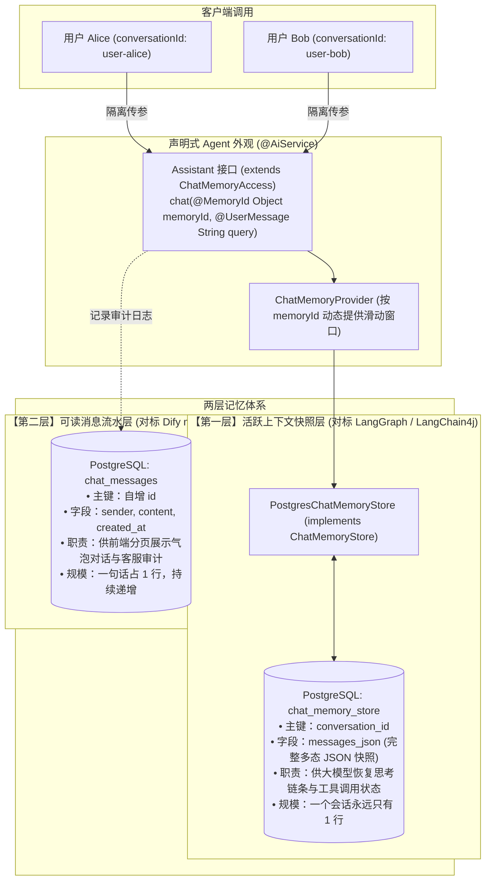

# 阶段五：生产级会话持久化与多层记忆系统实战指南 (PHASE5_GUIDE.md)

> 本文档用于完整复盘阶段五（进阶实战与生产就绪 —— 里程碑 5.1）的核心架构演进、底层机制剖析、踩坑复盘与实战指南。供日后复习、技术排查或架构扩展时随时对照查阅。

---

## 一、 为什么单例内存记忆无法走向生产？

在阶段三中，我们通过简单的 `MessageWindowChatMemory.withMaxMessages(10)` 实现了上下文保持。但在生产级场景下，这种单例内存模式存在两大致命缺陷：

| 维度 | 阶段三：单例内存记忆（玩具版） | 阶段五：两层持久化隔离记忆（生产版） |
| :--- | :--- | :--- |
| **多用户并发** | 全局唯一记事本，所有用户共享 10 条窗口，**严重相互串戏、泄露隐私**。 | 基于 `@MemoryId` 彻底实现**会话/租户级物理上下文隔离**。 |
| **服务生命周期** | 数据保存在 JVM 堆内存中，**服务重启即全部失忆**。 | 基于 PostgreSQL 硬盘持久化，**服务重启冷启动也能 100% 反序列化恢复**。 |
| **数据完整性** | 内存易丢失，无法溯源。 | **两层分离**：机器快照层（支持复杂工具调用）+ 人类审计流水层（支持界面展示）。 |
| **资源管控** | 内存对象无法释放，用户多了必定内存溢出（OOM）。 | 支持 `assistant.evictChatMemory(id)` 内存驱逐与 `chatMemory.clear()` 物理清空。 |

---

## 二、 两层记忆系统架构全景设计

借鉴 GitHub 顶流项目（LangGraph、Dify、MemGPT）的架构精髓，我们没有简单地建一张“聊天记录表”，而是设计了**分工明确的两层记忆体系**：



### 1. 为什么“快照层”与“流水层”必须分家？
* **大模型需要的是“上下文现场”**：不仅包含人话，更包含大模型发出的工具工单（`toolExecutionRequests`、调用工单号 `id`）以及本地返回给大模型的工具执行明细（`TOOL_EXECUTION_RESULT`）。如果强行拆成普通的文本表存，反序列化时会严重丢失结构，导致 Function Calling 上下文断裂；
* **人类需要的是“干净流水”**：前端展示给人类看的聊天气泡只需要“谁说的”、“说了什么内容”和“时间”，根本不需要看到那些冗长晦涩的 JSON Schema 和底层工单号。
* **分家后的优势**：机器快照走单行高效覆盖（Upsert），人类流水走单行只追加（Append-Only），各司其职，性能与可读性兼得。

---

## 三、 为什么技术选型拒绝 MyBatis-Plus，采用 Spring 原生 JdbcTemplate？

在工程设计初期，很多人下意识地想引入 MyBatis-Plus。但在 Agent 核心记忆持久化场景下，经过深入调研后我们坚决舍弃了它：

1. **场景本质不同**：
   Agent 的活跃记忆本质上是 **K-V / 状态快照**，而非传统企业管理系统的多表动态联查。它最高频的操作是 PostgreSQL 原生的高并发单行原子更新：
   ```sql
   INSERT INTO chat_memory_store (conversation_id, messages_json, updated_at)
   VALUES (?, ?, CURRENT_TIMESTAMP)
   ON CONFLICT (conversation_id) DO UPDATE SET
       messages_json = EXCLUDED.messages_json,
       updated_at = CURRENT_TIMESTAMP;
   ```
2. **PostgreSQL 方言特性支持**：
   PostgreSQL 的原子 Upsert（`ON CONFLICT DO UPDATE`）在 MyBatis-Plus 的抽象 Wrapper 中极难优雅表达，最后往往被迫写原生 XML。
3. **零黑盒魔法与初学者友好**：
   `JdbcTemplate` 是 Spring 官方自带的底层工具，零额外依赖、零拦截器干扰、零多余配置，十几行代码清晰见底，执行了什么 SQL、怎么映射的一清二楚。

---

## 四、 核心代码资产与深度机制剖析

### 1. 会话隔离与动态代理门面：`Assistant.java`
* **文件路径**：[`src/main/java/jin/agent/declarative/Assistant.java`](file:///D:/vibe/LearnAgent/src/main/java/jin/agent/declarative/Assistant.java)
* **核心继承**：`public interface Assistant extends ChatMemoryAccess`
  * 继承 `ChatMemoryAccess` 为代理对象开启了 `getChatMemory(memoryId)` 和 `evictChatMemory(memoryId)` 运维能力。
* **核心方法**：`String chat(@MemoryId Object memoryId, @UserMessage String userMessage);`
  * 当客户端调用时，动态代理拦截器截获带有 `@MemoryId` 的入参（如 `"user-bob"`），不再使用全局记事本，而是向工厂按 ID 索取该用户的专属记事本，从而实现**物理级别的会话隔离**。
* **向下兼容**：保留了单入参的 `chat(userMessage)`，当不传 `memoryId` 时，LangChain4j 默认路由至 `"default"` 会话，老测试完全不受影响。

### 2. 状态工厂与装配流水线：`AssistantConfig.java`
* **文件路径**：[`src/main/java/jin/agent/config/AssistantConfig.java`](file:///D:/vibe/LearnAgent/src/main/java/jin/agent/config/AssistantConfig.java)
* **核心装配**：
  ```java
  @Bean
  public ChatMemoryProvider chatMemoryProvider(PostgresChatMemoryStore postgresChatMemoryStore) {
      return memoryId -> MessageWindowChatMemory.builder()
              .id(memoryId)
              .maxMessages(10)
              .chatMemoryStore(postgresChatMemoryStore) // 关键：为每一个新造出的记事本插上 PostgreSQL 数据线
              .build();
  }
  ```
* **调用时机**：框架在内部维护了一个 `ConcurrentHashMap` 缓存池。只有当某个 `memoryId` **第一次访问**（或者刚才被显式驱逐）时，才会即时触发该工厂方法实例化一个专属的滑动窗口记事本，随后的多轮对话则直接复用内存实例。

### 3. 持久化存储与自愈清洗：`PostgresChatMemoryStore.java`
* **文件路径**：[`src/main/java/jin/agent/memory/PostgresChatMemoryStore.java`](file:///D:/vibe/LearnAgent/src/main/java/jin/agent/memory/PostgresChatMemoryStore.java)
* **实现了 `ChatMemoryStore` 标准接口的三大方法**：
  * **`getMessages(memoryId)`**：从数据库查询 `messages_json`，通过 `ChatMessageDeserializer.messagesFromJson` 还原多态消息列表；
  * **`updateMessages(memoryId, messages)`**：通过 `ChatMessageSerializer.messagesToJson` 序列化，利用 PostgreSQL 原生 `ON CONFLICT DO UPDATE` 单次网络 I/O 幂等覆盖更新；
  * **`deleteMessages(memoryId)`**：物理删除 `chat_memory_store` 中该会话的整行快照。
* **消息头自愈清洗（`sanitizeMessages`）核心防御机制**：
  * **踩坑现象**：滑动窗口淘汰（只留 10 条）按条切香肠时，可能刚好把最前面的 `UserMessage` 淘汰掉了，留下紧随其后的 `AiMessage(包含工具调用)` 或 `ToolExecutionResultMessage` 悬挂在窗口第一条。此时发给商汤日日新/OpenAI 兼容接口时，服务端会因为**“首条消息不是 User 消息”**而直接报错 `HTTP 400 InvalidRequestException`！
  * **自愈方案**：在 `getMessages` 读出消息塞给大模型之前，通过 `sanitizeMessages` 检查头部，**自动剔除首部残缺的孤儿 AI/Tool 响应，直到找到第一个正规的 User 提问**，让系统具备强大的自我容灾修复能力。

### 4. 生命周期闭环与对外端点：`AgentController.java`
* **文件路径**：[`src/main/java/jin/agent/controller/AgentController.java`](file:///D:/vibe/LearnAgent/src/main/java/jin/agent/controller/AgentController.java)
* **核心重构 —— 彻底重置会话的教科书级写法**：
  ```java
  @DeleteMapping("/conversations/{conversationId}")
  public Map<String, Object> evictConversation(@PathVariable String conversationId) {
      // 1. 获取该会话记事本并执行 clear()，底层会自动触发 postgresChatMemoryStore.deleteMessages(conversationId)
      ChatMemory chatMemory = assistant.getChatMemory(conversationId);
      if (chatMemory != null) {
          chatMemory.clear(); // 官方契约：清空内存消息并自动通知底层持久化层执行 deleteMessages
      } else {
          postgresChatMemoryStore.deleteMessages(conversationId); // 冷数据兜底直接删库
      }

      // 2. 从 LangChain4j 内存池中彻底注销驱逐该会话实例（释放 RAM 引用）
      assistant.evictChatMemory(conversationId);

      // 3. 物理删除流水审计表（chat_messages，清空前端展示日志）
      jdbcTemplate.update("DELETE FROM chat_messages WHERE conversation_id = ?", conversationId);

      return Map.of("status", "success", "message", "会话已彻底重置");
  }
  ```

---

## 五、 关键概念复盘：Evict vs Clear vs Delete

在日常开发中，必须严格区分这三个动作的层次：

| 动作与代码 | 操作对象 | 物理数据库是否被删？ | 适用场景 |
| :--- | :--- | :---: | :--- |
| **`assistant.evictChatMemory(id)`** | **JVM 堆内存（RAM）** | **否** | 用户离开/退出登录，把记事本从内存缓存 Map 中踢出，节省服务器内存。下次用户回来还可以从数据库恢复。 |
| **`chatMemory.clear()`** | **当前记事本内容** | **是**（自动触发 `store.deleteMessages`） | 用户想要“把当前会话清零重新聊”，清空内存列表并同步撕碎数据库里的旧快照。 |
| **`jdbcTemplate.update("DELETE...")`** | **PostgreSQL 物理磁盘** | **是** | 底层数据库物理操作，直接抹平数据行。 |

---

## 六、 常用 HTTP 调试与体验端点（对照 test.http）

在开发与测试时，直接通过 [`test.http`](file:///D:/vibe/LearnAgent/test.http) 发起以下请求：

### 1. 多会话隔离对话
* **用户 A 建立会话**：
  `GET http://localhost:8080/api/agent/declarative?conversationId=user-alice&query=你好，我是爱丽丝，我目前负责智能客服业务。`
* **用户 B 建立独立会话**：
  `GET http://localhost:8080/api/agent/declarative?conversationId=user-bob&query=hey,我是鲍勃,我目前在学习agent知识`
* **向用户 B 追问**（验证其记忆保持且不与用户 A 串戏）：
  `GET http://localhost:8080/api/agent/declarative?conversationId=user-bob&query=对于我想学习的内容,你有什么建议?`

### 2. 查看人类可读历史流水（对标 Dify messages 历史）
* **拉取鲍勃的对话明细**：
  `GET http://localhost:8080/api/agent/conversations/user-bob`

### 3. 三合一彻底重置会话
* **清空鲍勃的记忆与流水**：
  `DELETE http://localhost:8080/api/agent/conversations/user-bob`
  （执行后，再次发起提问，鲍勃将重新成为纯净的一张白纸）。

---

## 七、 自动化回归测试套件

本项目提供了专门的自动化回归测试类：[`ChatMemoryPersistenceLiveTest.java`](file:///D:/vibe/LearnAgent/src/test/java/jin/agent/ChatMemoryPersistenceLiveTest.java)：
* **测试用例 1**：`testMultiSessionIsolation` —— 验证 Alice 和 Bob 在多轮对话中姓名、颜色和业务画像绝对物理隔离，零串戏；
* **测试用例 2**：`testPostgresPersistenceAndColdRestartRecovery` —— 发送关键项目代号与宠物姓名，检查数据库快照落盘；随后主动调用 `evict` 驱逐 JVM 堆内存（模拟服务宕机重启），再次发问，断言 Agent 能从 PostgreSQL 100% 反序列化恢复记忆；
* **测试用例 3**：`testToolExecutionPersistence` —— 触发复杂工具调用，断言包含 `toolExecutionRequests` 与 `TOOL_EXECUTION_RESULT` 的多态 JSON 结构能无损保真落盘与跨轮引用。

执行验证命令：
```bash
./gradlew test --tests jin.agent.ChatMemoryPersistenceLiveTest
```
全套用例 100% 绿色通过。
