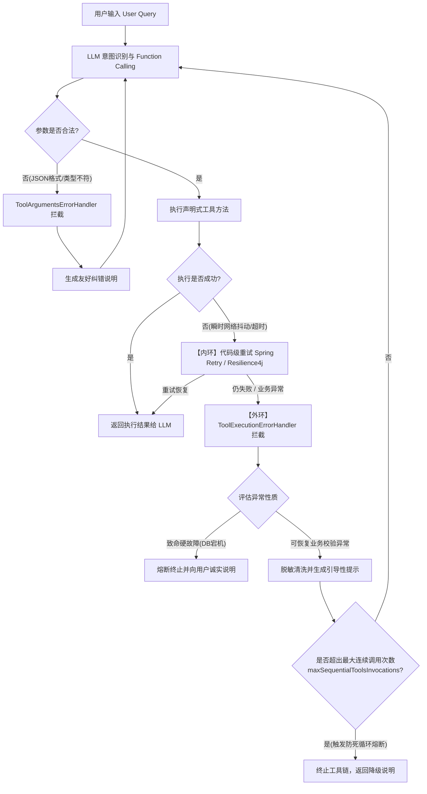

# 生产级工具调用容错、反思与自愈架构设计 (TOOL_ERROR_HANDLING_AND_REFLECTION.md)

> 本文档用于系统化阐述在 **Spring Boot + LangChain4j（声明式 `AiServices`）** 体系下，针对工具调用失败、异常处理、大模型反思与自愈（Self-Correction）及智能重试的技术方案与最佳实践。

---

## 一、 核心痛点与设计背景

在脱离了阶段一手写 `while` 循环后，项目全面转向 LangChain4j 的声明式 Agent 架构（基于 `@AiService` 动态代理与 OpenAI 标准 Function Calling）。在实际生产业务中，工具调用面对不可控的外部环境与大模型概率生成，必然会出现失败。

常见的不良实践（Anti-Patterns）：
1. **直接抛出未捕获异常**：导致整个 Spring Boot HTTP 接口 500 崩溃，用户体验极差；
2. **将底层技术堆栈生硬喂给大模型**：将诸如 `PSQLException`、连接超时、NullPointerException 等底层堆栈直接丢给 LLM，既造成 Token 浪费、泄露内部数据结构与敏感路径，又无法给大模型提供有效的纠错依据；
3. **陷入无限重试死循环**：大模型参数错误后，反复用相同的错误参数重试，导致调用次数耗尽或高昂的 API 账单。

因此，我们需要建立一套**“既防崩溃、又防泄密、更能驱动大模型自我纠错”**的生产级容错反思体系。

---

## 二、 核心架构：双环容错与反思机制

针对不同性质的故障，不能一概交由大模型思考，应当采用**“技术内环 + 认知外环”**的分层架构：



### 1. 内环（Technical Fast Loop，技术层透明重试）
* **职责**：处理网络瞬时闪断、Qdrant/MinIO 偶发连接超时、下游三方接口 429 速率限制等偶发性技术故障。
* **特点**：在 Spring Boot 代码层通过重试机制（如 Spring Retry / Resilience4j）就地重试 3 次（结合指数退避策略）。**完全对大模型透明，零 Token 开销，毫秒级快速恢复**。
* **准则**：绝不要让大模型去反思“数据库连接池满了”或“SocketTimeout”，模型对此无能为力。

### 2. 外环（Semantic Reflection Loop，认知层语义自愈）
* **职责**：处理参数超出业务范围、缺少前置业务字段、专有名词未检索到知识等语义层问题。
* **特点**：将捕获的业务异常脱敏清洗后，转为**带有纠错引导建议的文本**喂回大模型，驱动模型反思“为什么错了、该如何调整”。
* **准则**：工具的失败信息也是 Prompt 的一部分，必须具备明确的引导性。

---

## 三、 失败类型与分级应对策略

| 错误层级 | 典型场景 | 发生原因 | 框架拦截点 / 应对策略 |
| :--- | :--- | :--- | :--- |
| **第 1 层：Schema / 参数解析错误** | 大模型生成了非合法 JSON、把数值传为字符串、遗漏必填字段 | 模型对复杂参数的遵循度波动 | **`ToolArgumentsErrorHandler`**：拦截 JSON 解析异常，返回标准参数约束引导重试 |
| **第 2 层：业务校验不满足** | 计算圆面积传入负数半径、查询不存在的用户 ID | 参数格式合法，但业务逻辑不符 | **自解释业务提示**：工具抛出 `IllegalArgumentException` 或返回诊断说明，引导模型调整参数 |
| **第 3 层：知识库检索未召回** | 知识库内没有直接匹配的专有名词切片 | 关键词过于冷门或表述存在语义偏离 | **启发式反馈**：工具返回建议模型拆分关键词、换用近义词重试的文本 |
| **第 4 层：基础设施故障** | 容器网络断开、Qdrant 服务宕机、磁盘空间满 | 外部依赖故障 | **安全兜底拦截**：拦截后脱敏，转换为“服务暂时不可用”，防止泄露技术堆栈 |
| **第 5 层：死循环与重试风暴** | 模型反复使用相同错误入参不断重试 | 模型陷入思维惯性 | **熔断参数**：配置 `maxSequentialToolsInvocations` 设死上限（如 5 次） |

---

## 四、 LangChain4j 声明式核心组件与落地

在 LangChain4j 1.x 规范中，`dev.langchain4j.service.tool.*` 包提供了完整的工具异常治理能力：

### 1. 工具执行异常处理器：`ToolExecutionErrorHandler`
用于捕获 `@Tool` 方法抛出的所有业务或运行时异常，并决定是“阻断流程”还是“向 LLM 返回诊断提示”。

```java
import dev.langchain4j.service.tool.ToolExecutionErrorHandler;
import dev.langchain4j.service.tool.ToolErrorHandlerResult;
import org.slf4j.Logger;
import org.slf4j.LoggerFactory;

public class CustomToolExecutionErrorHandler implements ToolExecutionErrorHandler {
    private static final Logger log = LoggerFactory.getLogger(CustomToolExecutionErrorHandler.class);

    @Override
    public ToolErrorHandlerResult handleError(Throwable error, ToolErrorContext context) {
        log.warn("工具 [{}] 执行发生异常: {}", context.toolName(), error.getMessage(), error);

        // 1. 业务参数或前置校验异常（可引导模型自愈）
        if (error instanceof IllegalArgumentException) {
            String sanitizedMsg = "【工具执行受阻】" + error.getMessage() + "。请仔细检查输入条件并调整入参后重试。";
            return ToolErrorHandlerResult.text(sanitizedMsg);
        }

        // 2. 致命未预期异常：避免泄露内部堆栈，返回统一降级说明
        return ToolErrorHandlerResult.text("【工具暂时不可用】执行该工具时发生内部服务异常，请尝试换用其他方案或如实向用户说明。");
    }
}
```

### 2. 工具入参解析处理器：`ToolArgumentsErrorHandler`
用于捕获大模型在输出 Function Calling 参数时产生的反序列化/Schema 校验失败：

```java
import dev.langchain4j.service.tool.ToolArgumentsErrorHandler;
import dev.langchain4j.service.tool.ToolErrorHandlerResult;

public class CustomToolArgumentsErrorHandler implements ToolArgumentsErrorHandler {
    @Override
    public ToolErrorHandlerResult handleError(Throwable error, ToolErrorContext context) {
        return ToolErrorHandlerResult.text(
            "【入参解析失败】工具 '" + context.toolName() + "' 接收到的参数格式有误，请严格对照该工具的参数类型说明重新构造调用请求。"
        );
    }
}
```

### 3. 防死循环熔断：`maxSequentialToolsInvocations`
在构建 `AiServices` 时显式配置最大连续调用深度（默认为空或默认值），有效规避死循环导致的资费爆炸：

```java
Assistant assistant = AiServices.builder(Assistant.class)
        .chatModel(chatModel)
        .tools(mathTools, knowledgeTools)
        .chatMemoryProvider(chatMemoryProvider)
        // 核心安全防线：单轮会话中允许工具连续调用/重试的最大次数
        .maxSequentialToolsInvocations(5)
        .toolExecutionErrorHandler(new CustomToolExecutionErrorHandler())
        .toolArgumentsErrorHandler(new CustomToolArgumentsErrorHandler())
        .build();
```

---

## 五、 工具契约设计与 Prompt 心智工程

反思与自愈的成功率，极大程度取决于**工具返回结果的表达质量**与**系统人设的引导约束**。

### 1. 工具的自解释原则（Self-Explanatory Tools）
工具不要只返回单纯的“数据”，在异常或空结果时，应返回“诊断建议”。

以现有项目的 `KnowledgeTools` 为例：
```java
@Tool("从企业私域知识库中查询团队规范、办公地点、入职指引、技术架构等资料")
public String searchKnowledge(@P("搜索关键词或自然语言问题") String query) {
    List<KnowledgeService.SearchResultItem> matches = knowledgeService.hybridSearch(query, 3);
    
    if (matches.isEmpty()) {
        // 自解释型返回：提示大模型换词重试
        return "【检索结果】知识库中未检索到与 '" + query + "' 相关的文档切片。\n"
             + "【建议】请尝试去除专有名词中的标点修饰，或换用近义词、范围更广的关键词重新调用 searchKnowledge。";
    }

    return matches.stream()
            .map(m -> "【参考资料片段】:\n" + m.text())
            .collect(Collectors.joining("\n\n"));
}
```

### 2. 在 SystemMessage 中确立反思法则
大模型需要被明确授权和告知“遇到工具失败时应该如何思考”。在 `Assistant.java` 中注入自愈规范：

```java
@SystemMessage("""
    你是一个专业的企业综合智能助理。
    请严格遵循以下行为准则：
    1. 遇到私域知识库问题调用 searchKnowledge，遇到数学计算调用数学工具；
    
    【工具调用失败与自愈反思规范】
    2. 当工具返回【工具执行受阻】、【入参解析失败】或提示【未检索到相关文档】时，你必须主动进行反思与自愈：
       - 分析返回的具体错误原因（如参数越界、类型不符、关键词过窄等）；
       - 结合上下文修正入参（例如：调整计算参数、改写更通用的搜索关键词）并发起重试；
       - 若经过尝试依然无法成功，严禁凭空捏造事实，必须如实向用户说明遇到的客观困难与建议。
    """)
public interface Assistant extends ChatMemoryAccess {
    String chat(@MemoryId Object memoryId, @UserMessage String userMessage);
}
```

---

## 六、 生产环境必须遵循的避坑守则

1. **写操作工具必须保证幂等性（Idempotency）**
   * 如果工具涉及数据库写入、转账扣款、发送邮件等有副作用的操作，**严禁在失败后盲目自动重试**。因为网络超时可能发生在响应阶段（即后端已经写库成功但客户端没收到响应）。在此类工具上应引入 `idempotencyKey` 防重机制。
2. **严防敏感数据二次泄露**
   * 异常堆栈中的 SQL 语法错误、服务器本地物理绝对路径、数据库连接串密码等，**绝不允许直接输出给大模型**。必须在 `ToolExecutionErrorHandler` 中做过滤与白名单格式化。
3. **技术重试走内环，认知重试走外环**
   * 简单的网络闪断用 Spring Retry / Resilience4j 在本地秒级解决，千万不要每次网络抖动都让大模型重新经历一次完整的推理思考（既耗时又烧 Token）。
